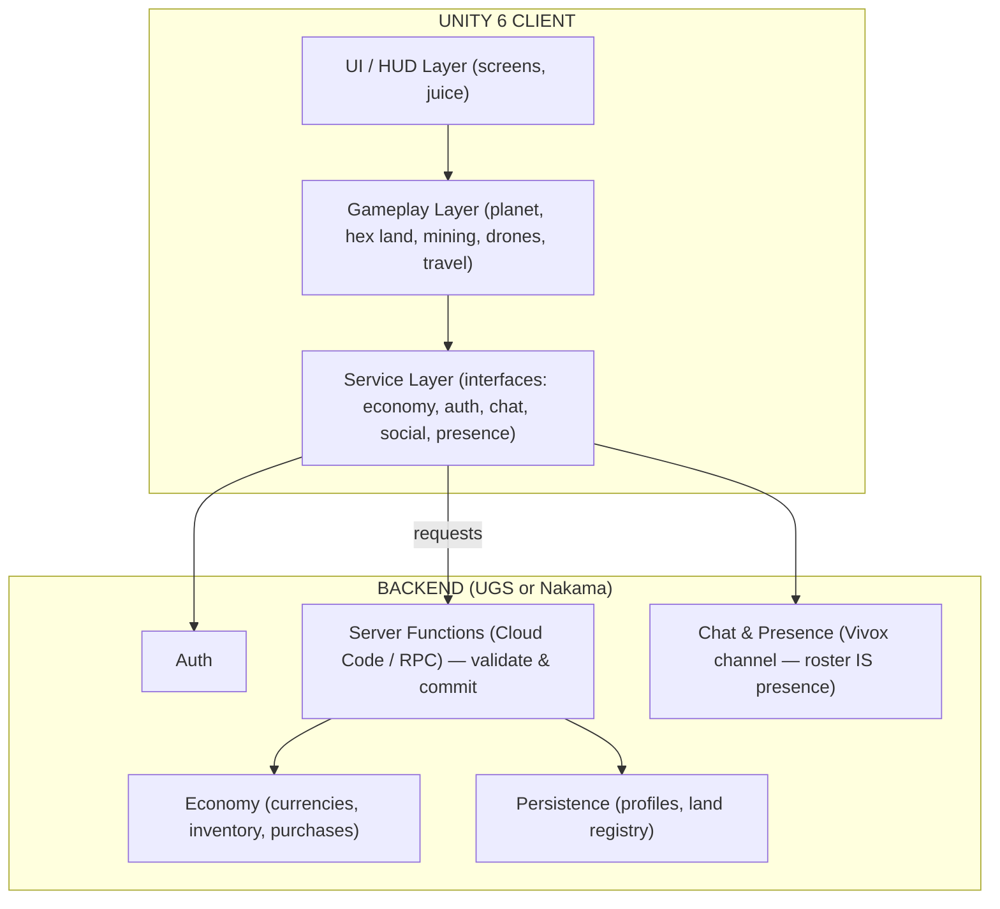

# Social Universe — Architecture, System Design & Script Plan

*Build reference for Unity 6 + Claude Code. Keep this in the repo (e.g. `/docs/ARCHITECTURE.md`) and reference it from `CLAUDE.md` so Claude Code always has the plan in context.*

---

## 1. Tech Stack

**Confirmed**
- **Engine:** Unity 6 (URP recommended for the mobile cosmic look).
- **Land grid:** Hexasphere Grid System (tile generation, selection, coloring, the inherent 12 pentagons).
- **Models on hand:** planets + moon, drone, asteroid, rocket. *Missing and to acquire:* player avatar, space-station, building/decoration set, UI kit.
- **Input:** Unity Input System (also exposes the gyroscope/attitude sensor).

**Backend — recommendation.** A persistent social MMO with an economy needs three things the engine doesn't give you: presence + chat (players never share a live simulation or move in real time — there's no co-located movement to sync), persistence (profiles, land, currency), and a **server-authoritative economy**. Two clean ways to get all three:

- **Primary recommendation — Unity Gaming Services (UGS):** Authentication, Cloud Save, **Economy** (currencies, inventory, virtual purchases — server-authoritative out of the box, a perfect fit for Coins/Stardust/land), Cloud Code (custom server logic), **Vivox** (text chat *and* presence — the roster of a planet's Vivox channel *is* the presence list; no Lobby/Relay/Netcode layer), Remote Config, Analytics. Easiest Unity integration; minimal backend code.
- **Strong alternative — Nakama (Heroic Labs):** one cohesive game server for realtime + chat + storage + RPC + wallet/economy + leaderboards, self-hosted or cloud.

**Architectural rule:** the backend sits **behind interfaces** (`IEconomyService`, `IAuthService`, `IChatService`, …). M1 ships against a `LocalMock*` implementation so the core loop is fun offline; M2 swaps in the real backend with no gameplay rewrites. Don't pick the backend on day one — pick the interfaces.

**Resolved in M5:** Sky Discovery uses the **gyroscope-controlled virtual starfield** (Input System `AttitudeSensor`, with a mouse/touch-drag fallback when unavailable) rather than camera AR — see `GyroInputProvider`/`SkyDiscoveryController` and `PROGRESS.md`'s M5 section.

---

## 2. Architectural Principles

1. **Server-authoritative economy.** The client never mints currency or grants ownership. It *requests*; the server *validates and commits*. Mining, land purchase, yield claims, upgrades, and purchases all go through server functions.
2. **Backend behind interfaces.** Gameplay depends on `I*Service` abstractions, never on the SDK directly.
3. **Data in ScriptableObjects.** Planets, asteroids, drones, items, costs, and yield curves are designer-editable SO assets, not hardcoded.
4. **Decouple via events.** Systems talk through an event bus / ScriptableObject events, not direct references, so screens and systems can be built and tested in isolation.
5. **Composition over inheritance** for gameplay; thin `MonoBehaviour` views, logic in plain C# services.
6. **One responsibility per script.** Every file below has a single clear job — that's what makes it a good Claude Code unit of work.

**Patterns used:** lightweight DI / Service Locator (VContainer recommended) · finite state machine for app flow · MVP for UI (passive views + presenters) · ScriptableObject configs + event channels · request/validate/commit for all economy ops.

---

## 3. High-Level Architecture



**Authority split (what's client vs server):**

| Concern | Client | Server (authoritative) |
|---|---|---|
| Rendering, input, camera, gyro, AR, animation, juice | ✅ | — |
| Local prediction (show mining taps, optimistic UI) | ✅ | — |
| Currency balances, inventory, land ownership | cache only | ✅ source of truth |
| Mining payout, offline income, yield claims | request | ✅ compute & grant |
| Land purchase / sale / upkeep | request | ✅ validate & commit |
| Drone upgrades, level-ups, quest rewards | request | ✅ grant |
| IAP / season pass | initiate | ✅ receipt-validate & grant |
| Presence (who's in a planet's Vivox channel) | display roster | — (no host/relay; Vivox channel roster is the presence list) |
| Chat messages, reports, blocks | send/display | ✅ store, filter, moderate |

---

## 4. Project Structure & Conventions

```
Assets/_Project/
  Art/            (models, materials, sprites, fonts)
  Prefabs/        (planet, drone, asteroid, rocket, player, UI screens)
  Scenes/         (Bootstrap, Auth, SolarSystem, Planet, Station)
  ScriptableObjects/ (the *Definition assets, configs)
  Scripts/
    Core/         SocialUniverse.Core
    Config/       SocialUniverse.Config        (ScriptableObject definitions + registry)
    World/        SocialUniverse.World         (planet, hexasphere, tiles, camera)
    Mining/       SocialUniverse.Mining        (drones, asteroids, mining loop)
    Economy/      SocialUniverse.Economy       (wallet, land, marketplace, yield)
    Net/          SocialUniverse.Net           (auth, backend client, presence, shards)
    Social/       SocialUniverse.Social        (chat, friends, profiles, moderation)
    Travel/       SocialUniverse.Travel        (star map, fuel, sky discovery, rocket)
    Progression/  SocialUniverse.Progression   (player state, XP, quests, daily, inventory)
    Guild/        SocialUniverse.Guild         (stations, guilds, events)
    Store/        SocialUniverse.Store         (IAP, season pass, ads)
    Safety/       SocialUniverse.Safety        (settings, age gate, moderation hooks, analytics)
    UI/           SocialUniverse.UI            (UIManager, HUD, screens, views, juice)
  Tests/          (EditMode + PlayMode)
ServerCode/        (Cloud Code functions / Nakama modules — NOT shipped in client)
```

**Conventions:** namespaces mirror folders (`SocialUniverse.World`). Interfaces prefixed `I`. ScriptableObject configs suffixed `Definition` / `Config`. Services suffixed `Service`. Screens suffixed `Screen`, reusable views `View`. One public type per file, file named after the type.

---

## 5. Scenes & Flow

- **Bootstrap** — boots services, then loads Auth. (Never has gameplay; survives via DontDestroyOnLoad container.)
- **Auth** — login + first-run onboarding entry.
- **SolarSystem** — star map / travel hub.
- **Planet** — the core scene: hexasphere land, mining, social, build. Loaded additively per planet/shard.
- **Station** — guild hub (M7).

App flow is a state machine: `Boot → Auth → (Onboarding) → Hub(SolarSystem) ↔ Planet ↔ Station`.

---

## 6. Data Model

**ScriptableObject configs (designer-editable):** `PlanetDefinition`, `AsteroidDefinition`, `DroneDefinition`, `ItemDefinition` (buildables/cosmetics), `CurrencyDefinition` (Coins, Stardust), `UpgradeDefinition`, `EconomyConfig` (prices, yields, sinks, upkeep), `QuestDefinition`, `SeasonPassDefinition`.

**Server-persisted records (source of truth):** `PlayerProfile` (id, name, level, xp, badges), `Wallet` (coins, stardust), `Inventory` (items, minerals, drones), `LandRegistry` (tileId → ownerId, buildState, yieldRate, isLandmark), `GuildRecord`, `MarketListing`, `FuelState`, `QuestProgress`, `DailyStreak`.

---

## 7. Script Inventory by Milestone

Priority tags follow the PRD: **P0** = core/MVP, **P1** = launch, **P2** = later. Each script is one focused unit of work for Claude Code.

### M0 — Foundation & Bootstrap  *(exit: empty app boots through state machine, configs load, events fire)*

| Script | Folder | Responsibility | Pri |
|---|---|---|---|
| `Bootstrapper` | Core | Entry point; build the service container, init in order, load Auth scene | P0 |
| `ServiceContainer` | Core | DI registration/resolution (or wrap VContainer) | P0 |
| `GameManager` | Core | Owns global app state; coordinates top-level systems | P0 |
| `GameStateMachine` + `IGameState` | Core | FSM driving Boot/Auth/Hub/Planet/Station | P0 |
| `BootState`,`AuthState`,`HubState`,`PlanetState` | Core | Concrete states (later states added per milestone) | P0 |
| `SceneLoader` | Core | Async additive scene load/unload with progress | P0 |
| `EventBus` | Core | Global typed publish/subscribe | P0 |
| `GameEvent` / `GameEventListener` | Core | ScriptableObject event channels for the inspector | P0 |
| `AppConfig` (SO) | Config | Global tunables, environment selection | P0 |
| `SULog` | Core | Logging wrapper with channels | P0 |
| `Constants` / `SaveKeys` | Core | Centralized keys and magic values | P0 |

### M1 — Core Loop Prototype (offline, local mock)  *(exit: "is explore→mine→own fun in 5 min?" — single planet, mine, buy a tile, all against LocalMock services)*

| Script | Folder | Responsibility | Pri |
|---|---|---|---|
| `PlanetController` | World | Spawn planet model + hexasphere for a `PlanetDefinition` | P0 |
| `HexasphereManager` | World | Wrap Hexasphere Grid System; generate tiles, expose selection/hover events | P0 |
| `TileData` | World | Per-tile runtime model (id, owner, buildState, yield, isLandmark) | P0 |
| `TileSelectionController` | World | Raycast pick a tile, raise `TileSelected` | P0 |
| `TileColorizer` | World | Color tiles by state (owned/other/available/landmark) | P0 |
| `LandmarkService` | World | Identify the 12 pentagons; flag legendary | P1 |
| `PlanetCameraController` | World | Orbit/zoom camera around the sphere | P0 |
| `PlanetDefinition` (SO) | Config | Planet theme, tile count, land multiplier, asteroid tier, model ref | P0 |
| `DatabaseRegistry` | Config | Central lookup of all SO definitions (Addressables) | P0 |
| `AsteroidSpawner` | Mining | Spawn the asteroid field for a planet | P0 |
| `Asteroid` | Mining | Asteroid runtime (mineral type/amount, depletion) | P0 |
| `DroneController` | Mining | Drone movement/visual toward target asteroid | P0 |
| `DroneRuntime` | Mining | Live drone instance + current stats | P0 |
| `MiningController` | Mining | Orchestrate a mining session (idle + active) | P0 |
| `IdleMiningCalculator` | Mining | Compute offline haul up to cargo cap | P0 |
| `ActiveMiningMinigame` | Mining | Tap/combo/crit logic and feedback hooks | P0 |
| `IEconomyService` + `LocalMockEconomy` | Economy | Balances/spend/grant interface + offline stub | P0 |
| `Wallet` | Economy | Client-cached balances + change events | P0 |
| `LandPurchaseService` (mock) | Economy | Buy a tile: request → (mock) commit ownership | P0 |
| `EconomyConfig` (SO) | Config | Prices, mining yields, cargo cap, sinks | P0 |
| `PlayerState` | Progression | Runtime player data (level, fuel, caches) | P0 |

### M2 — Networking, Auth & Persistence  *(exit: real login, server-authoritative wallet, state persists across sessions)*

| Script | Folder | Responsibility | Pri |
|---|---|---|---|
| `IAuthService` + `AuthService` | Net | Anonymous + Apple/Google sign-in | P0 |
| `IBackendClient` + `BackendClient` | Net | RPC / Cloud Code call wrapper, retries, error mapping | P0 |
| `NetworkBootstrap` | Net | Initialize UGS/Nakama, environment, session | P0 |
| `ICloudSave` + `CloudSaveService` | Net | Load/save profile + state records | P0 |
| `EconomyService` (real) | Economy | Replace `LocalMockEconomy` against backend Economy | P0 |
| `ConnectionManager` | Net | Connect, reconnect, offline handling | P1 |
| `ServerTime` | Net | Authoritative clock for idle income / timers | P0 |
| **Server functions** | ServerCode | `GrantOfflineIncome`, `PurchaseLand`, `Mine(validate)`, `GetBootstrapState` | P0 |

### M3 — Land System Depth  *(exit: networked ownership visible to others, visitor-driven yield, build mode)*

| Script | Folder | Responsibility | Pri |
|---|---|---|---|
| `LandRegistryService` | Economy | Fetch/subscribe tile ownership for a planet | P0 |
| `YieldService` | Economy | Compute & claim visitor-driven land income | P1 |
| `VisitorTracker` | Economy | Count/attribute visits to plots (server-backed) | P1 |
| `UpkeepService` | Economy | Recurring land tax sink | P2 |
| `BuildController` | World | Place/move/remove buildables on an owned tile | P1 |
| `BuildPaletteService` | World | Available buildables by ownership/inventory | P1 |
| `TileExtrusionView` | World | Reflect build level via tile height | P1 |
| `ItemDefinition` (SO) | Config | Buildables/decor: cost, rarity, yield bonus | P1 |
| **Server functions** | ServerCode | `ClaimYield`, `PlaceBuild`, `ApplyUpkeep`, `SellLand` | P1 |

### M4 — Social: Presence, Chat, Friends, Profiles  *(exit: see others on a planet, chat with moderation, add friends, view profiles)*

| Script | Folder | Responsibility | Pri |
|---|---|---|---|
| `IPresenceService` + `VivoxPresenceService` | Net | Who is on this planet right now, derived from the roster of the planet's Vivox text channel (no separate session/host) | P0 |
| ~~`ShardManager`~~ | ~~Net~~ | **Removed** — no Lobby/Relay sessions or shard-walking; one Vivox channel per planet is the only "room" concept | — |
| ~~`NetworkPlayer`~~ | ~~Net~~ | **Removed** — no replicated player objects; players never see each other move | — |
| ~~`PlayerSyncController`~~ | ~~Net~~ | **Removed** — no position sync; there is no co-located movement to replicate | — |
| `IChatService` + `ChatService` | Social | Channels, send/receive (Vivox text-only) | P0 |
| `ChatChannelController` | Social | Global / guild / DM channel switching (per-planet Local channel deferred — see PROGRESS.md) | P0 |
| `ChatModerationFilter` | Social | Client-side profanity filter (server also enforces) | P0 |
| `ReportService` | Social | Report / block / mute | P0 |
| `FriendsService` | Social | Add/remove/list + presence | P1 |
| `DirectMessageService` | Social | Cross-planet DMs between friends | P1 |
| `ProfileService` + `PlayerProfile` | Social | Fetch/update profile, badges, stats | P1 |
| **Server functions** | ServerCode | `SubmitReport`, `BlockUser`, `ModerateMessage` | P0 |

### M5 — Travel & Solar System  *(exit: star map travel, fuel as a recharging gauge, gyro Sky Discovery with Star Map fallback)*

| Script | Folder | Responsibility | Pri |
|---|---|---|---|
| `SolarSystemController` | Travel | Owns the star-map scene/hub | P0 |
| `StarMapController` | Travel | Render planets/orbits, selection, info | P0 |
| `TravelService` | Travel | Validate fuel, run transition, switch scene+shard | P0 |
| `FuelSystem` | Travel | Fuel state, time-based recharge, free trip home, refill | P1 |
| `RocketController` | Travel | Travel animation + optional dodge minigame | P2 |
| `SkyDiscoveryController` | Travel | Gyroscope sky view, lock-on to bodies | P1 |
| `GyroInputProvider` | Travel | Read attitude sensor; graceful fallback flag | P1 |

### M6 — Drones & Mining Depth  *(exit: drone upgrade tree, slots, asteroid tiers gating exploration)*

| Script | Folder | Responsibility | Pri |
|---|---|---|---|
| `DroneGarageController` | Mining | Garage screen logic, slot management | P1 |
| `DroneUpgradeService` | Mining | Apply upgrades (server-validated) | P1 |
| `DroneDefinition` / `UpgradeDefinition` (SO) | Config | Base stats + upgrade curves | P1 |
| `AsteroidDefinition` (SO) | Config | Tier, mineral table, rarity, value | P1 |
| `MineralInventory` | Mining | Track mined minerals (server-backed) | P1 |
| **Server functions** | ServerCode | `UpgradeDrone`, `UnlockDroneSlot` | P1 |

### M7 — Space Stations & Guilds  *(exit: join/found a station, co-build, perks, scheduled events)*

| Script | Folder | Responsibility | Pri |
|---|---|---|---|
| `StationController` | Guild | Station scene/hub | P2 |
| `GuildService` | Guild | Create/join, roster, roles | P2 |
| `GuildUpgradeService` | Guild | Contributions, station level, perks (e.g. −fuel) | P2 |
| `EventService` | Guild | Scheduled festivals/tournaments | P2 |
| **Server functions** | ServerCode | `CreateGuild`, `JoinGuild`, `Contribute`, `StartEvent` | P2 |

### M8 — Marketplace & Economy Depth  *(exit: player-to-player land/mineral trade, auctions)*

| Script | Folder | Responsibility | Pri |
|---|---|---|---|
| `MarketplaceService` | Economy | Listings, search, buy | P2 |
| `AuctionService` | Economy | Bids, timers, settlement | P2 |
| `LeaderboardService` | Progression | Wealth / visitors / guild rankings | P2 |
| **Server functions** | ServerCode | `ListItem`, `BuyListing`, `PlaceBid`, `SettleAuction` | P2 |

### M9 — Monetization  *(exit: store, premium currency purchase, season pass, opt-in ads — all receipt-validated)*

| Script | Folder | Responsibility | Pri |
|---|---|---|---|
| `IStoreService` + `IAPService` | Store | Unity IAP wrapper, products | P1 |
| `StoreCatalog` | Store | Packs, bundles, fuel refills | P1 |
| `SeasonPassService` + `SeasonPassDefinition` (SO) | Store | Tiers, track, rewards | P2 |
| `AdService` | Store | Rewarded ads, opt-in only | P2 |
| **Server functions** | ServerCode | `ValidateReceipt`, `GrantPurchase`, `ClaimPassTier` | P1 |

### M10 — Safety, Settings & Platform  *(exit: moderation enforced, age policy, settings, analytics, notifications)*

| Script | Folder | Responsibility | Pri |
|---|---|---|---|
| `SettingsService` | Safety | Gyro/notifications/reduce-motion/chat-filter level | P1 |
| `AgeGateService` | Safety | Age policy + minor-mode restrictions | P0 |
| `ModerationService` | Safety | Hooks to server moderation pipeline | P0 |
| `AnalyticsService` | Safety | Funnel/retention/economy events | P1 |
| `NotificationService` | Safety | Local + push (cargo full, fuel ready, events) | P1 |

### M11 — UI, Progression Juice & Onboarding  *(spans all milestones; finalized here)*

| Script | Folder | Responsibility | Pri |
|---|---|---|---|
| `UIManager` | UI | Root UI, screen stack/navigation | P0 |
| `ScreenBase` | UI | Base for screens (show/hide/bind) | P0 |
| `HUDController` | UI | Persistent HUD: level, XP, currencies, fuel | P0 |
| `CurrencyView`,`XPBarView`,`FuelGaugeView`,`QuestCardView`,`RarityFrame` | UI | Reusable HUD/loot views | P0–P1 |
| `*Screen` set | UI | Home, PlanetHUD, Mining, LandPurchaseSheet, MyLandBuild, DroneGarage, StarMap, SkyDiscovery, Chat, Friends, Profile, Station, Marketplace, Store, Settings | P0–P2 |
| `LevelUpModal`,`RewardPopup`,`ToastService` | UI | Reward moments + feedback | P1 |
| `ButtonPressEffect`,`TweenHelper`,`RewardBurst` | UI | 3D button press, tweens, burst FX | P1 |
| `ProgressionService` | Progression | XP/level curve + level-up rewards | P0 |
| `QuestService` + `QuestDefinition` (SO) | Progression | Daily quests, progress, claim | P1 |
| `DailyRewardService` | Progression | Login streak rewards | P1 |
| `InventoryService` | Progression | Owned items/cosmetics/minerals cache | P0 |
| `OnboardingController` | Progression | Guided first session, sub-60s first win | P1 |

---

## 8. Milestone Roadmap (summary)

| Milestone | Goal | Maps to PRD phase |
|---|---|---|
| M0 Foundation | Boots, FSM, configs, events | Prototype |
| M1 Core loop (offline) | Prove explore→mine→own is fun | Prototype |
| M2 Net/Auth/Persist | Real login + server-authoritative wallet | Vertical slice |
| M3 Land depth | Networked ownership, visitor yield, build | Vertical slice |
| M4 Social | Presence, chat, friends, profiles | Vertical slice |
| M5 Travel | Star map, fuel, sky discovery | Vertical slice / Alpha |
| M6 Drones/Mining | Upgrades, tiers | Alpha |
| M7 Stations/Guilds | Co-owned hubs, events | Alpha |
| M8 Marketplace | Trading, auctions, leaderboards | Alpha |
| M9 Monetization | Store, pass, ads | Beta |
| M10 Safety/Platform | Moderation, age policy, analytics | Beta |
| M11 UI/Juice/Onboarding | Polish + first-session win | Beta → Launch |

---

## 9. Working With Claude Code

**Setup.** Put this file at `/docs/ARCHITECTURE.md`. Create a `CLAUDE.md` at the repo root that says: "Read `/docs/ARCHITECTURE.md` before any task. Respect the authority split in §3 — never put currency, ownership, or reward logic on the client; route it through a server function. Work one milestone at a time. Keep the backend behind the `I*Service` interfaces."

**Workflow per milestone.**
1. Tell Claude Code the milestone and paste that milestone's table.
2. Have it scaffold the folder + interfaces + `LocalMock` first, so the feature compiles and runs before the backend exists.
3. Implement script by script. For each, give it: the responsibility (from the table), the public API you expect, its dependencies, and an acceptance test.
4. Ask for an EditMode or PlayMode test per service; require it to pass before moving on.
5. One feature branch per milestone; small commits per script.

**Guardrails to repeat to Claude Code.**
- Economy/ownership/reward changes are **server-validated**; the client requests and reflects results — it never decides them.
- New tunable numbers go in a ScriptableObject `*Config`, not in code.
- Systems communicate through events/interfaces, not direct cross-namespace references.
- Don't introduce a new third-party package without flagging it; prefer the chosen stack.
- Mobile budget: pool drones/asteroids/FX; load only the active planet's hex grid and stream its tile state (don't instantiate every planet).

**Definition of done (any script):** compiles, single responsibility, depends only on interfaces/config, has a test or a manual repro step, and respects the authority split.

---

## 10. Open Decisions to Resolve Early

1. **Backend:** UGS (recommended) vs Nakama — decide before M2; interfaces in M1 make this swappable.
2. **Sky Discovery:** camera AR vs gyro starfield — ✅ resolved in M5 (gyro starfield).
3. **Age policy / rating** — decide before M4 (drives chat restrictions and moderation scope).
4. **Land resale** — coins-only, no real-money cash-out, no NFT framing (per GDD); confirm before M8.
5. **DI framework:** VContainer vs hand-rolled Service Locator — decide in M0.
